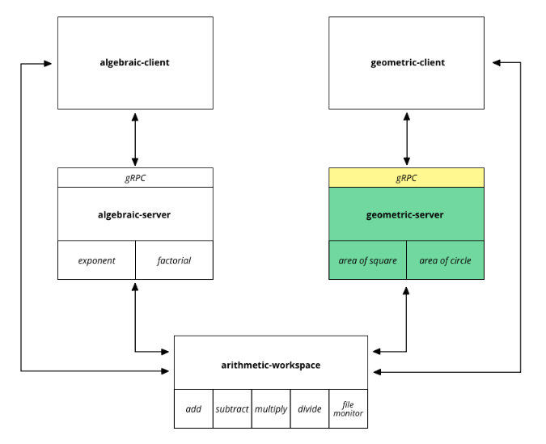

This is the `geometric-server` module from our blog post: [A full-fledged Rust architecture based on workspaces and gRPC](https://blog.nullnet.ai/blog/workspaces-grpc).

This repository contains a Rust gRPC server built with [`tonic`](https://github.com/hyperium/tonic) to compute geometric operations such as shape areas. 
It also includes a facade to expose to its clients, hiding the gRPC layer from them.

  <picture>
    
  </picture>

